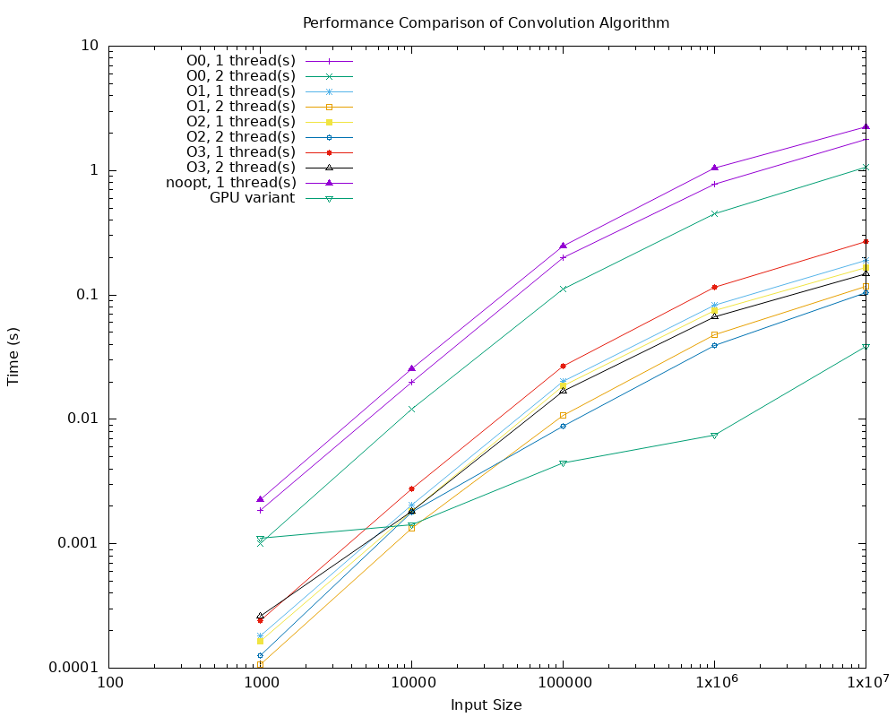

# 🚀 GPGPU Akceleracija 2D Konvolucije Slika

Ovaj projekat istražuje i demonstrira tehnike optimizacije performansi za računarski intenzivnu operaciju 2D diskretne konvolucije na slikama. Počevši od osnovne sekvencijalne implementacije, kod je progresivno optimizovan korišćenjem kompajlerskih flegova, OpenMP paralelizacije i na kraju, implementacijom **GPGPU varijante** radi postizanja maksimalnog ubrzanja.

Projekat je realizovan u C++ programskom jeziku i uključuje sopstveni parser za 24-bitne BMP fajlove, kao i detaljan mehanizam za merenje i analizu performansi.

---

## ✨ Ključne funkcionalnosti

* **2D Konvolucija**: Implementacija algoritma za primenu proizvoljnog konvolucionog kernela na slike (npr. za efekte kao što su *Box Blur*, *Sharpen*, *Edge Detection*).
* **Sopstveni BMP Parser**: Ručno realizovan parser za učitavanje i čuvanje nekompresovanih 24-bitnih BMP slika.
* **Parametrizacija putem komandne linije**: Mogućnost specifikacije ulazne i izlazne putanje, kao i vrednosti konvolucionog kernela.
* **Sveobuhvatna analiza performansi**: Sistematsko poređenje različitih varijanti algoritma:
    * Sekvencijalna vs. Kompajlerski optimizovana (`-O0` do `-O3`, SIMD).
    * Sekvencijalna vs. Višejezgarna (OpenMP).
    * CPU (OpenMP) vs. **GPGPU (CUDA)**.
* **Automatizovana skripta za merenje**: Priložena je `bash` skripta koja automatski izvršava sva merenja za različite veličine ulaza i konfiguracije, i čuva rezultate.

---

## 🛠️ Realizovane varijante algoritma

1.  **Sekvencijalna varijanta**: Osnovna, neoptimizovana implementacija kao polazna tačka za merenja.
2.  **Kompajlerski optimizovana varijanta**: Verzija koja koristi visoke nivoe kompajlerskih optimizacija (`-O3`) i automatsku SIMD vektorizaciju (`-march=native`).
3.  **Višejezgarna (OpenMP) varijanta**: CPU paralelizacija algoritma korišćenjem OpenMP biblioteke za skaliranje na više jezgara.
4.  **GPGPU varijanta**: Najbrža verzija algoritma, realizovana u **CUDA C++**, koja izvršava konvoluciju na masivno paralelnoj arhitekturi grafičke kartice.

---

## 🚀 Kako pokrenuti

### Preduslovi
* GCC/G++ kompajler
* NVIDIA CUDA Toolkit 

### Izvršavanje
Program se pokreće iz komandne linije. Kernel se prosleđuje kao string brojeva odvojenih zarezom.

```bash
# Skripa script.sh pokrece sva mjerenja za kernel koji se mora specifikovati u komandnoj liniji ali je potrebno genereisati slike odgovarajucih velicina 1000, 10000, 100000, 1000000, 10000000.
Za generisanje slika se moze koristiti generateImages kod kojom se prosledjuje putanja do slike i putanja do izlaznog foldera.
```

---

## 📊 Automatizacija merenja

Skripta `run_benchmarks.sh` pokreće sve definisane testove za različite verzije algoritma i veličine slika, i generiše `results.csv` fajl spreman za crtanje grafikona.

```bash
# # Skripa full.sh pokrece sva mjerenja sa tri predefinisana kernela za testiranje a kao ulazni parametar se prosledjuje slika koja se koristi za testiranje.
```

---

## 📈 Rezultati i analiza

Analiza je pokazala da GPGPU varijanta donosi drastično ubrzanje u odnosu na sve CPU varijante, uključujući i onu paralelizovanu sa OpenMP. Ubrzanje raste sa veličinom slike, potvrđujući efikasnost GPGPU pristupa za obradu velikih setova podataka.

Detaljni grafikoni i analiza se nalaze u priloženom izveštaju (`Izvjestaj.pdf`).

  

---

## ⚙️ Tehnički detalji

* **BMP Parser**: Parser čita `BMP File Header` i `DIB Header` kako bi dobio dimenzije slike i poziciju početka piksel niza. Podržava 24-bitni format (8 bita po kanalu - BGR).
* **GPGPU Implementacija**:
    * **Kernel**: CUDA C++ kernel je napisan tako da svaki thread obrađuje jedan izlazni piksel.
    * **Memorija**: Korišćena je optimizacija prenosa memorije između `host` (CPU) i `device` (GPU) memorije.
    * **Struktura Thread-ova**: Lansirana je 2D mreža thread blokova koja odgovara dimenzijama slike.

---
